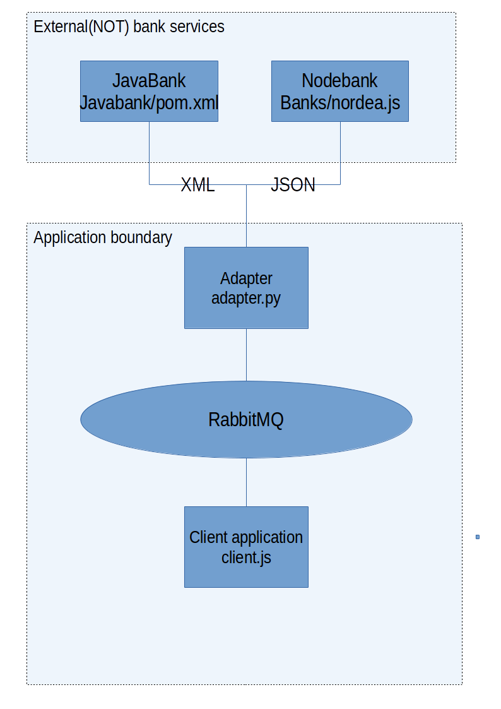

## Arhitecture overview



## Running the maddness

### Launch the banks:

```
node banks/nordea.js
```

```
mvn -f JavaBank package
java -jar JavaBank/target/Bank-1.0-SNAPSHOT.war
```

### Launch RabbitMQ

Depends on your setup, have fun.

### Launch adapters for the banks(RabbitMQ must be running)

```
ADAPTER=nodebank python3 rabbitMq/adapters/adapter.py
ADAPTER=javabank python3 rabbitMq/adapters/adapter.py
```

### Launch client application

```
node rabbitMq/client/client.js 
```


## Java bank 

### Example java bank request:

```sh
curl -H "Content-Type: application/xml"  -H "Accept: application/xml" -d  '<LoanRequest><amount>12</amount><durationInMonths>51</durationInMonths></LoanRequest>' localhost:8080
```

### Example  java bank response:

```xml
<LoanResponse>
    <loans>
        <amount>12.0</amount>
        <interest>5.0</interest>
        <durationInMonths>54</durationInMonths>
    </loans>
    <loans>
        <amount>12.0</amount>
        <interest>4.0</interest>
        <durationInMonths>51</durationInMonths>
    </loans>
    <loans>
        <amount>12.0</amount>
        <interest>3.0</interest>
        <durationInMonths>25</durationInMonths>
    </loans>
    <loans>
        <amount>12.0</amount>
        <interest>2.0</interest>
        <durationInMonths>51</durationInMonths>
    </loans>
</LoanResponse>
```